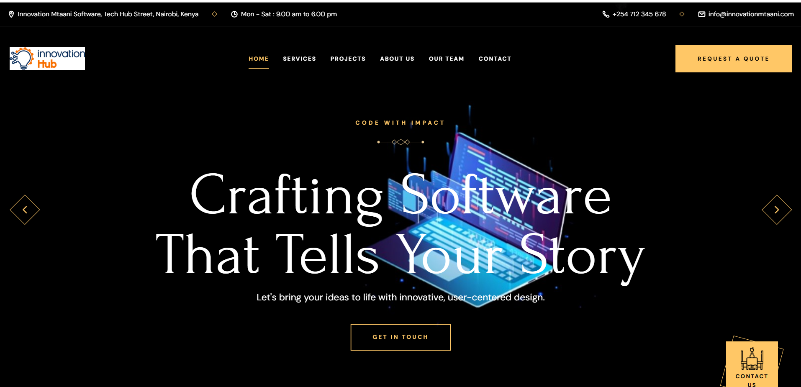

# InnovationHub Softwares

<div align="center">
  
  
  
  
  [](https://twitter.com/intent/follow?screen_name=innovationhubsw)

  <br />
  <br />

  <h2 align="center">InnovationHub Softwares - Modern Technology Solutions</h2>

  InnovationHub Softwares is a fully responsive technology company website, <br />Responsive for all devices, built using HTML, CSS, and JavaScript.

  <a href="https://innovationhubsoftwares.com"><strong>➥ Live Demo</strong></a>

</div>

<br />

## 📸 Demo Screenshots




## 🚀 Features

- **Modern & Clean Design:** Professional interface that represents our technology brand
- **Fully Responsive:** Optimized for all screen sizes (mobile, tablet, desktop)
- **Optimized Performance:** Fast loading times with optimized assets
- **Interactive UI Elements:** Smooth animations and transitions
- **Contact Form Integration:** Direct customer inquiries to our team
- **SEO Optimized:** Structured for search engine visibility
- **Cross-Browser Compatible:** Works on all modern browsers

## 🛠️ Technologies Used

- HTML5
- CSS3 (with Flexbox/Grid)
- JavaScript (ES6+)
- GSAP (for animations)
- Font Awesome Icons
- Google Fonts
- Responsive Design
- Webpack (for bundling)
- Netlify/Vercel (deployment)

## 📋 Prerequisites

Before you begin, ensure you have met the following requirements:

* [Git](https://git-scm.com/downloads "Download Git") installed on your operating system
* [Node.js](https://nodejs.org/en/download/) installed (version 14.x or above)
* Basic understanding of web development tools

## 🔧 Installation & Setup

### Clone the Repository

```bash
# Clone the repository
git clone https://github.com/innovationhub/company-website.git

# Navigate to the project directory
cd company-website

# Install dependencies
npm install

# Start development server
npm run dev
```

The website should now be running on `http://localhost:3000`

### Development

```bash
# Run development server with hot-reload
npm run dev

# Build for production
npm run build

# Preview production build
npm run preview
```

## 📁 Project Structure

```
company-website/
├── assets/
│   ├── css/
│   ├── js/
│   ├── images/
│   └── fonts/
├── components/
├── pages/
├── public/
├── index.html
├── package.json
├── README.md
└── ...
```

## 🚀 Deployment

The website is deployed using [Netlify](https://www.netlify.com/)/[Vercel](https://vercel.com/). Any push to the main branch will trigger a new deployment.

### Manual Deployment

```bash
# Build for production
npm run build

# Deploy using Netlify CLI
netlify deploy --prod
```

## 📝 Adding New Content

### Adding New Projects to Portfolio

1. Add project images to `assets/images/portfolio/`
2. Update the portfolio data in `js/portfolio-data.js`
3. The new project will automatically appear in the portfolio section

### Updating Team Members

1. Add team member images to `assets/images/team/`
2. Update the team data in `js/team-data.js`
3. The new team member will be displayed in the team section

## 📈 Performance Optimization

- All images are optimized and compressed
- CSS and JS files are minified in production
- Lazy loading implemented for images
- Font loading optimized with font-display swap

## 🌐 Browser Support

- Chrome (latest)
- Firefox (latest)
- Safari (latest)
- Edge (latest)
- Opera (latest)

## 🤝 Contributing

1. Fork the repository
2. Create your feature branch (`git checkout -b feature/amazing-feature`)
3. Commit your changes (`git commit -m 'Add some amazing feature'`)
4. Push to the branch (`git push origin feature/amazing-feature`)
5. Open a Pull Request

## 📞 Contact

For any inquiries, please reach out to:

- **Email:** contact@innovationhubsoftwares.com
- **Twitter:** [@innovationhubsw](https://twitter.com/innovationhubsw)
- **LinkedIn:** [InnovationHub Softwares](https://linkedin.com/company/innovationhub-softwares)

## 📜 License

This project is licensed under the MIT License - see the [LICENSE](LICENSE) file for details.

---

© 2025 InnovationHub Softwares. All Rights Reserved.